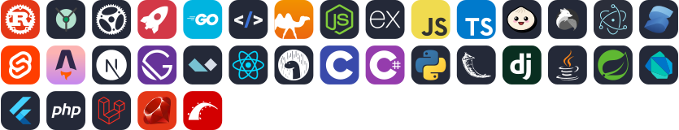

### Sup'
I'm Suyash.\
I program for fun.\
IE11 + php + ajax, goated

#### Current Fav Tech Stacks:
- Go (pref. Fiber or Gin) + HTMX + Templ + Postgres
- Rust (pref. Axum) + Yew + Postgres

_only some client side/personal projs are public on my github_ 

#### Languages & Frameworks I've Used:
<!------>

#### Other Stuff I Currently Use:
<!------>

